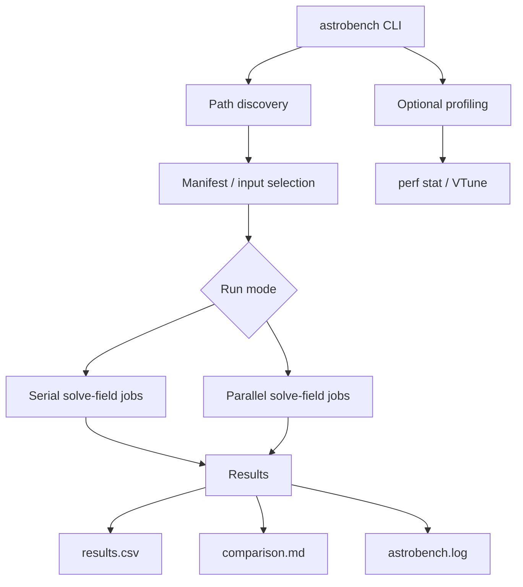

[toc]
# Astrobench readme

## Purpose
Astrobench is a repository-integrated CLI utility for running and measuring Astrometry.net batch solving experiments.
It has three main purposes:

1. run outer-layer parallelization by executing multiple independent solve-field jobs concurrently;
2. compare serial batch execution against parallel batch execution;
3. collect lightweight profiling evidence for performance experiments.

Astrobench does not modify the internal Astrometry.net solver. Each image is still solved by a normal solve-field process. The current parallelization layer improves batch throughput, not the internal runtime of one individual image solve.

## Required prerequisites
Astrobench expects these folders to exist either inside the repository or one directory above it.
Recommended workspace shape:

```Plain
workspace/
├── astrometry.net/
├── astrometry-install/
│   ├── bin/
│   │   └── solve-field
│   └── etc/
│       └── astrometry.cfg
└── profiling/
    ├── data/
    │   └── categorized_5img_set/
    │       ├── clean/
    │       ├── noisy/
    │       ├── blurred/
    │       └── disturbed/
    └── runs/
```


## Required:

1. astrometry-install/bin/solve-field
2. astrometry-install/etc/astrometry.cfg
3. profiling/data/categorized_5img_set/
4. profiling/runs/
5. Python 3

### Optional:

- Linux perf, for `profile --tool perf-stat`
- Intel VTune, for optional deeper profiling
- FlameGraph tools, for future deep profiling extensions

Astrobench uses path discovery first. If needed, paths can be overridden:
./bin/astrobench --astrometry-install /path/to/astrometry-install --profiling-root /path/to/profiling doctor

## Repository layout
```
astrometry.net/
├── bin/
│   └── astrobench
├── lib/python/astrometry/benchmark/
│   ├── __init__.py
│   ├── cli.py
│   ├── config.py
│   ├── pathscan.py
│   ├── model.py
│   ├── manifest.py
│   ├── command.py
│   ├── executor.py
│   ├── runner.py
│   ├── profiler.py
│   ├── vtune.py
│   ├── recorder.py
│   ├── compare.py
│   ├── logging_utils.py
│   └── worker_suggest.py
└── examples/benchmark/
    └── astrobench.toml
```

## Concept diagram
 



## Output Directory       

```
flowchart TD
    A[astrobench CLI] --> B[Path discovery]
    B --> C[Manifest / input selection]
    C --> D{Run mode}

    D --> E[Serial solve-field jobs]
    D --> F[Parallel solve-field jobs]

    E --> G[Results]
    F --> G

    G --> H[results.csv]
    G --> I[comparison.md]
    G --> J[astrobench.log]

    A --> K[Optional profiling]
    K --> L[perf stat / VTune]
```

## Basic commands
```
Run all commands from the Astrometry.net repository root.
cd /path/to/astrometry.net
chmod +x ./bin/astrobench

Check setup:
./bin/astrobench --verbose doctor

Suggest worker counts:
./bin/astrobench suggest-workers

Generate a controlled workload:
./bin/astrobench --verbose manifest --workload mixed20

Run the official serial-vs-parallel benchmark:
./bin/astrobench --verbose benchmark --workload mixed20 --workers <OFFICIAL_WORKERS>

Collect profiling evidence:
./bin/astrobench --verbose profile --tool perf-stat --workload mixed20 --workers 1
./bin/astrobench --verbose profile --tool perf-stat --workload mixed20 --workers <OFFICIAL_WORKERS>

Run Astrobench as a practical batch solver on an arbitrary image folder:
./bin/astrobench --verbose run \
  --input-dir /path/to/images \
  --limit 20 \
  --workers aggressive \
  --run-label my_batch

Compare an arbitrary image folder serially and in parallel:
./bin/astrobench --verbose benchmark \
  --input-dir /path/to/images \
  --limit 20 \
  --workers official \
  --run-label my_batch_comparison

```

## Output directory
Astrobench writes results under:
profiling/runs/astrobench/

Typical benchmark output:

```
profiling/runs/astrobench/<timestamp>_mixed20_wN/
├── astrobench.log
├── config_snapshot.toml
├── manifest.txt
├── system_snapshot.json
├── serial_w1/
│   ├── run.json
│   ├── results.csv
│   └── jobs/
├── parallel_wN/
│   ├── run.json
│   ├── results.csv
│   └── jobs/
├── comparison.csv
└── comparison.md
```
Typical single run output:
```
profiling/runs/astrobench/<timestamp>_<label>_wN/
├── astrobench.log
├── manifest.txt
├── run.json
├── results.csv
└── jobs/
```

Each job folder contains:
- command.txt
- stdout.log
- stderr.log
- solver_output/

## How to read the output
The main benchmark file is:
comparison.md

A clean benchmark proof requires:

same job count in serial and parallel runs;
same success count in serial and parallel runs;
lower elapsed time for the parallel run.

Correct interpretation:
Outer-layer parallelization improved batch throughput.

Incorrect interpretation:
One individual image was solved faster inside the internal solver.

The internal solver remains unchanged.

## Tips and cautions
Use suggest-workers before choosing the worker count.
Start official benchmarks with the suggested official worker count. Use aggressive or stress only for exploration.
If parallel runs show timeouts or fewer successful solves, the run is not a clean proof. Reduce workers or increase timeout settings in:
examples/benchmark/astrobench.toml

VTune is optional and heavier than normal benchmarking. Use it only for deeper analysis, not as the primary proof.
Do not commit generated profiling runs, solver outputs, VTune result folders, or perf.data files. These are local artifacts.
